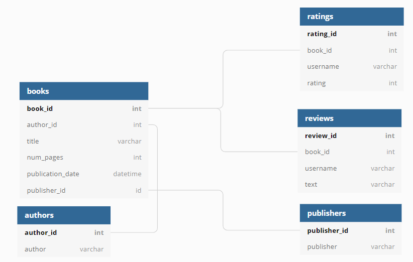

# Análisis de una base de datos de libros con SQL

## Descripción

Proyecto de análisis de una base de datos PostgreSQL perteneciente a una plataforma de libros. Mediante consultas SQL se analizaron el catálogo, las calificaciones y reseñas de los usuarios, así como el desempeño de autores y editoriales.

El objetivo fue obtener información relevante sobre el comportamiento de la plataforma y responder preguntas de negocio a partir de los datos disponibles.

## Base de datos

La base contiene cinco tablas relacionadas:

- `books`: información de los libros.
- `authors`: autores.
- `publishers`: editoriales.
- `ratings`: calificaciones realizadas por los usuarios.
- `reviews`: reseñas de texto.

### Modelo de datos



> El diagrama de la base de datos fue proporcionado por TripleTen como parte de los materiales del proyecto.

## Análisis realizado

Se utilizaron consultas SQL para:

- identificar los libros publicados después del 1 de enero de 2000;
- analizar la cantidad de reseñas y las calificaciones de los libros;
- determinar la editorial con mayor número de libros de más de 50 páginas;
- identificar al autor con mayor calificación promedio considerando únicamente libros con al menos 50 calificaciones;
- analizar la actividad de los usuarios con mayor número de calificaciones.

Además, se realizó una revisión inicial de la estructura, tipos de datos, valores ausentes y duplicados de las tablas.

## Hallazgos principales

- **819 de 1,000 libros (81.9 %)** fueron publicados después del 1 de enero de 2000.
- Los libros presentan un promedio de **2.79 reseñas** y una calificación promedio de **3.90**.
- Se identificaron **6 libros sin reseñas**.
- **Penguin Books** registró **42 libros** con más de 50 páginas, el mayor número entre las editoriales analizadas.
- Entre los libros con al menos 50 calificaciones, **J.K. Rowling/Mary GrandPré** obtuvo la mayor calificación promedio, con **4.29**.
- Los usuarios que calificaron más de 50 libros realizaron, en promedio, **24.33 reseñas de texto por usuario**.

## Herramientas

- **SQL / PostgreSQL**
- **Python**
- **Pandas**
- **SQLAlchemy**
- **Jupyter Notebook**

## Estructura del repositorio

```text
SQL/
├── .env.example
├── .gitignore
├── Diagrama_base_datos.png
├── Proyecto_SQL_Analisis_Base_Datos_Libros.ipynb
├── README.md
└── requirements.txt
```

## Revisión y reproducción

La base de datos utilizada fue proporcionada por TripleTen para el desarrollo del proyecto y **no se redistribuye en este repositorio**. Las credenciales de conexión tampoco se incluyen.

El notebook conserva los resultados obtenidos durante la ejecución original, por lo que las consultas SQL, sus resultados y el análisis pueden revisarse sin acceso a la base de datos.

Para volver a ejecutar el notebook es necesario disponer de acceso a una instancia PostgreSQL compatible con el esquema utilizado en el proyecto.

### Configuración para ejecución

1. Instalar las dependencias:

```bash
pip install -r requirements.txt
```

2. Crear un archivo `.env` a partir de `.env.example` y completar las credenciales correspondientes:

```env
DB_USER=
DB_PASSWORD=
DB_HOST=
DB_PORT=6432
DB_NAME=
```

3. Con acceso válido a la base de datos, abrir `Proyecto_SQL_Analisis_Base_Datos_Libros.ipynb` y ejecutar las celdas en orden.

## Autor

**Adrian Novoa Monzón**  
Data Analyst en Formación – TripleTen

## Datos de contacto

- **CV:** <a href="https://github.com/ADRIAN-NOVOA-MONZON/PORTAFOLIO/blob/main/ADRIAN%20NOVOA%20CV%20DATA%20ANALYST.pdf" target="_blank" rel="noopener noreferrer">PDF</a>
- **LinkedIn:** [adrian-novoa-monzon](https://www.linkedin.com/in/adrian-novoa-monzon)
- **Email:** [adrian-novoa-monzon@gmail.com](mailto:adrian-novoa-monzon@gmail.com)
